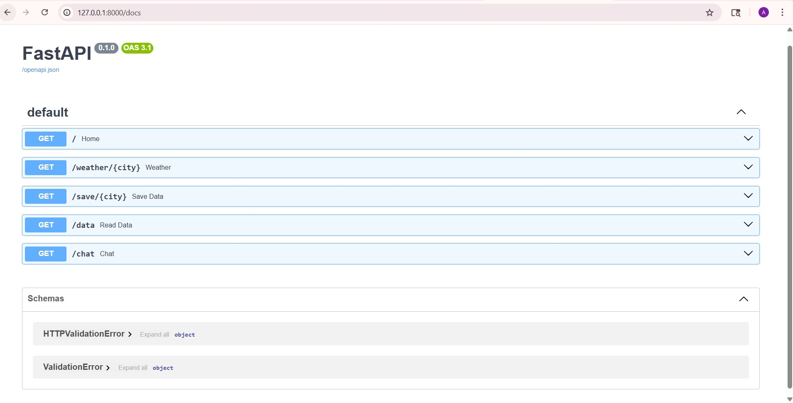

# Weather API Project (FastAPI)

# Overview

This project is a backend API built using FastAPI that fetches real-time weather data, stores it, and provides a simple chat-based interface.

# Why I built this

I wanted to learn how backend systems integrate with external APIs and how data can be stored and retrieved efficiently.

# Features

* Get live weather data using external API
* Save weather data with timestamp
* Retrieve stored data
* Chat-based weather query (`/chat` endpoint)

# Tech Stack

* Python
* FastAPI
* Requests

# Project Structure

* main.py → API logic
* data.json → stored data

# API Demo



# Sample Output

```json
[
  {
    "city": "pune",
    "temperature": "34",
    "time": "2026-03-31 17:06:26"
  }
]
```

# How to Run

```bash
uvicorn main:app --reload
```

Open:
http://127.0.0.1:8000/docs

# Learning Outcome

* API development
* API integration
* Backend concepts
* JSON handling
